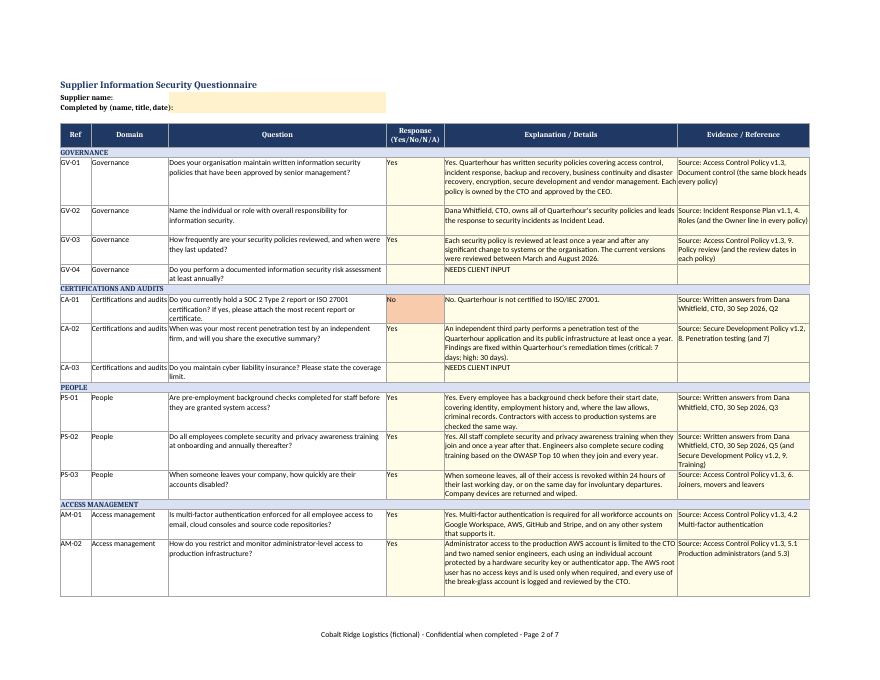
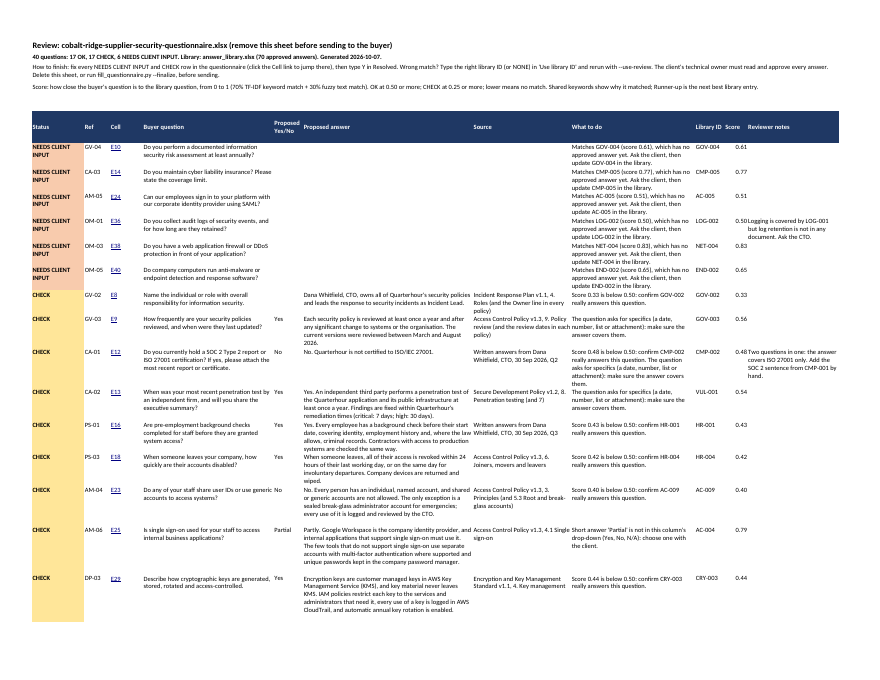

# Portfolio sample (fictional)

Everything in this folder is **made up**. Quarterhour, Inc. is a fictional 12-person scheduling SaaS; Cobalt Ridge Logistics is a fictional buyer. Any resemblance to real companies is coincidental. Use these files to practise and to show prospects how you work. Never show real client work.

## What to show a prospect

- [`output/cobalt-ridge-supplier-security-questionnaire_DRAFT2.pdf`](output/cobalt-ridge-supplier-security-questionnaire_DRAFT2.pdf): the filled questionnaire and its review sheet, readable on a phone.
- The two previews below, or the `.xlsx` files if they use Excel.





## The story, file by file

| Step | File | What it shows |
|---|---|---|
| 1 | `policies/` | The client's seven short policies: five Markdown files, one Word file (`encryption-standard.docx`) and one PDF (`business-continuity-plan.pdf`). They deliberately leave gaps (no SOC 2, nothing on insurance, log retention or anti-malware). |
| 2 | `library/answer_library_DRAFT.xlsx` | Output of `build_library.py`: 95 seed questions, 68 with a candidate source (document, section, excerpt) and 27 NEEDS CLIENT INPUT. No answers yet. See the Evidence and Documents sheets. |
| 3 | `client_input/written-answers-cto-2026-09-30.md` | The CTO's written replies to the first gap list. Answers built on them cite this record. |
| 4 | `library/answer_library.xlsx` | The completed library: 70 Approved answers, each with source, excerpt, owner and review date; 25 still NEEDS CLIENT INPUT. `build_library.py --check` reports no problems. |
| 5 | `library/questions_for_client.md` | The 25 open questions, generated with `--check --gaps`, ready to send. |
| 6 | `questionnaire/cobalt-ridge-supplier-security-questionnaire.xlsx` | The buyer's 40-question file, written for this kit (not copied from SIG or CAIQ): merged section rows, a Yes/No/N/A drop-down fed from a hidden sheet, red fill for "No", a cell note and print settings. |
| 7 | `output/cobalt-ridge-supplier-security-questionnaire_DRAFT.xlsx` | First pass straight from `fill_questionnaire.py`: 15 OK, 18 CHECK, 7 NEEDS CLIENT INPUT. Two matches are wrong (DP-02 and RS-04); both are flagged, which is the point of the review sheet. |
| 8 | `output/cobalt-ridge-supplier-security-questionnaire_DRAFT2.xlsx` | After the freelancer's review pass: the two matches corrected by typing BCP-002 and CRY-002 in "Use library ID" and rerunning with `--use-review`, and notes added for the client (17 OK, 17 CHECK, 6 NEEDS CLIENT INPUT). This is what goes to the client with the cover note. |
| 9 | `output/*.pdf`, `output/preview-*.png` | DRAFT2 exported with LibreOffice, for showing prospects. |

## Things worth pointing out to a prospect

- **Nothing is invented.** The draft library found "SOC 2 report" in the vendor policy, but that sentence is about Quarterhour's *vendors*. The completed library answers CMP-001 from the CTO's written reply instead: "No. Quarterhour does not currently have a SOC 2 report."
- **Traps are caught.** "Customer managed keys" in the encryption standard means keys Quarterhour manages in AWS, not keys its customers manage. CRY-006 (bring your own key) stays NEEDS CLIENT INPUT, with a note explaining why.
- **Every answer is traceable.** Each filled answer has "Source: document, section" beside it, and the review sheet links straight to each cell.
- **Gaps are honest.** Insurance, risk assessment, customer SSO, WAF and anti-malware come back as NEEDS CLIENT INPUT rather than guesses.
- **The buyer's file is untouched apart from the answers.** Formatting, the drop-down, the red "No" highlighting and the cell note all survive.

## Rebuild the sample outputs

From `kits/security-questionnaire/`:

```sh
python scripts/build_library.py --docs samples/policies --out samples/library/answer_library_DRAFT.xlsx --client "Quarterhour, Inc. (FICTIONAL SAMPLE)" --owner "Dana Whitfield, CTO"
python scripts/build_library.py --check samples/library/answer_library.xlsx --gaps samples/library/questions_for_client.md --client "Quarterhour, Inc. (fictional)"
python scripts/fill_questionnaire.py samples/questionnaire/cobalt-ridge-supplier-security-questionnaire.xlsx --library samples/library/answer_library.xlsx --out samples/output/cobalt-ridge-supplier-security-questionnaire_DRAFT.xlsx
python scripts/fill_questionnaire.py samples/questionnaire/cobalt-ridge-supplier-security-questionnaire.xlsx --library samples/library/answer_library.xlsx --use-review samples/output/cobalt-ridge-supplier-security-questionnaire_DRAFT2.xlsx --out samples/output/cobalt-ridge-supplier-security-questionnaire_DRAFT2.xlsx
soffice --headless --convert-to pdf --outdir samples/output samples/output/cobalt-ridge-supplier-security-questionnaire_DRAFT2.xlsx
```

The completed library (step 4) was written by hand from the draft and the sources, as you would for a client; the scripts never write answers.
